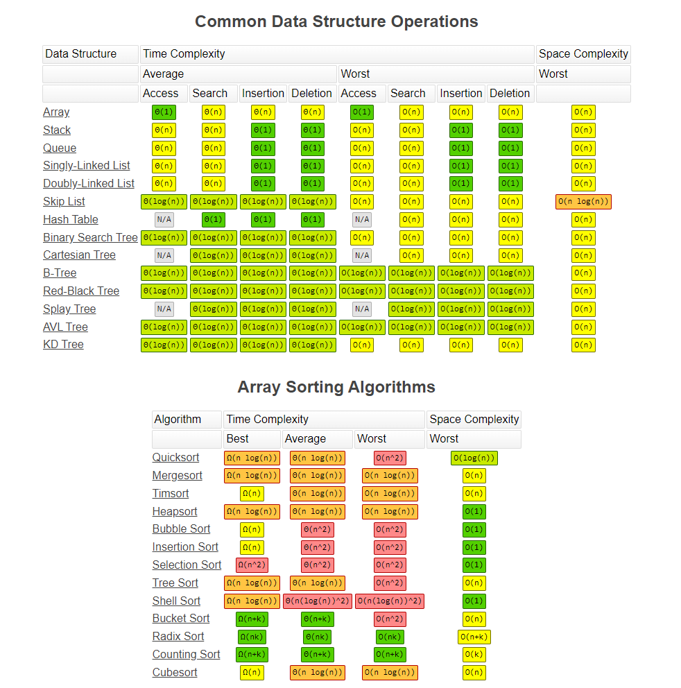

# algorithms
Collections of short common algorithms for building reference

## Time and Space Complexity

ref https://www.bigocheatsheet.com/

#### Python bult-in functions
https://wiki.python.org/moin/TimeComplexity
